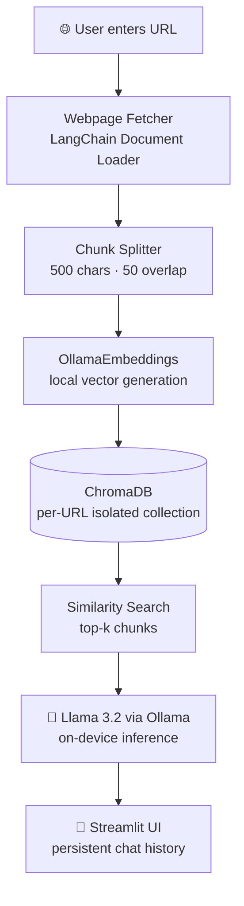

<!-- Self-hosted header (assets/header.svg): always loads, readable in light AND dark mode -->

<!-- Typing SVG: theme-aware colours -->
<a href="https://git.io/typing-svg">
  <picture>
    <source media="(prefers-color-scheme: dark)" srcset="https://readme-typing-svg.demolab.com?font=JetBrains+Mono&weight=700&size=22&duration=3000&pause=1000&color=C084FC&center=true&vCenter=true&width=700&height=50&lines=Full-Stack+Engineer+%F0%9F%9A%80;AI+%26+RAG+Pipeline+Builder+%F0%9F%A4%96;Spring+Boot+%7C+React+%7C+LangChain+%7C+JWT;Open+to+Internships+%26+Collaborations!">
    <source media="(prefers-color-scheme: light)" srcset="https://readme-typing-svg.demolab.com?font=JetBrains+Mono&weight=700&size=22&duration=3000&pause=1000&color=6D28D9&center=true&vCenter=true&width=700&height=50&lines=Full-Stack+Engineer+%F0%9F%9A%80;AI+%26+RAG+Pipeline+Builder+%F0%9F%A4%96;Spring+Boot+%7C+React+%7C+LangChain+%7C+JWT;Open+to+Internships+%26+Collaborations!">
    
  </picture>
</a>

 

---

## 👨‍💻 About Me

I'm a **full-stack developer from Pune** who loves turning ideas into secure, production-style applications, and building **AI apps that never leave your machine**.

- 🎯 **Focus:** Full-Stack Web Development · AI / RAG Pipeline Engineering · Secure Backends (JWT + Spring Security + RBAC)
- 🔭 **Exploring:** Microservices & Docker · System Design & Scalability · Cloud (AWS)
- 📍 **Location:** Pune, Maharashtra, India
- 🤝 **Open to:** Internships & Collaborations
- ⚡ **Fun fact:** My LLM apps run 100% on-device: no API keys, no data leakage

---

## 🛠️ Tech Arsenal

**⚙️ Backend** 

**🎨 Frontend** 

**🤖 AI / ML** 
 
`LangChain` · `Ollama (Llama 3.2)` · `ChromaDB` · `Google Gemini API` · `RAG Pipelines`

**🗄️ Databases** 

**🔧 Tools & Platforms** 

---

## 🚀 Featured Projects

| 🔖 Project | 💡 Description | ⚡ Stack | 🔗 |
|:---|:---|:---|:---:|
| 🦙 **LlamaLocal + RAG** | Privacy-first RAG: chat with any webpage using an on-device LLM. Zero API keys, zero data leakage | Python · LangChain · Ollama · ChromaDB · Streamlit |  |
| 🛒 **StickyVibe** | Full-stack e-commerce with Stripe payments, JWT auth and a Redux SPA | React · Redux · Spring Boot · JWT · MySQL · Stripe |  |
| 🏫 **EazySchool** | School ERP with 3-tier RBAC for students, teachers and admins | Spring Boot · Thymeleaf · Spring Security · MySQL |  |
| 🌾 **Smart Crop Advisory** | AI farming platform using Google Gemini for crop and irrigation advice | Spring Boot · Gemini API · Java · Thymeleaf |  |

### 🦙 LlamaLocal RAG: How it works

---

## 📊 GitHub Stats

<!-- Stats card -->
<a href="https://github.com/harshaddhonde4">
  <picture>
    <source media="(prefers-color-scheme: dark)" srcset="https://github-readme-stats.vercel.app/api?username=harshaddhonde4&show_icons=true&hide_border=true&bg_color=0d1117&title_color=c084fc&icon_color=22d3ee&text_color=c9d1d9&count_private=true">
    <source media="(prefers-color-scheme: light)" srcset="https://github-readme-stats.vercel.app/api?username=harshaddhonde4&show_icons=true&hide_border=false&border_color=e2e8f0&bg_color=ffffff&title_color=6d28d9&icon_color=0891b2&text_color=334155&count_private=true">
    
  </picture>
</a>

<!-- Streak -->
<a href="https://git.io/streak-stats">
  <picture>
    <source media="(prefers-color-scheme: dark)" srcset="https://streak-stats.demolab.com?user=harshaddhonde4&hide_border=true&background=0d1117&stroke=a855f7&ring=a855f7&fire=f97316&currStreakLabel=c084fc&currStreakNum=c9d1d9&sideNums=c9d1d9&sideLabels=94a3b8&dates=64748b">
    <source media="(prefers-color-scheme: light)" srcset="https://streak-stats.demolab.com?user=harshaddhonde4&hide_border=false&border=e2e8f0&background=ffffff&stroke=e2e8f0&ring=6d28d9&fire=f97316&currStreakLabel=6d28d9&currStreakNum=334155&sideNums=334155&sideLabels=475569&dates=64748b">
    
  </picture>
</a>

<!-- Top languages -->
<a href="https://github.com/harshaddhonde4">
  <picture>
    <source media="(prefers-color-scheme: dark)" srcset="https://github-readme-stats.vercel.app/api/top-langs/?username=harshaddhonde4&layout=compact&hide_border=true&bg_color=0d1117&title_color=c084fc&text_color=c9d1d9&langs_count=8">
    <source media="(prefers-color-scheme: light)" srcset="https://github-readme-stats.vercel.app/api/top-langs/?username=harshaddhonde4&layout=compact&hide_border=false&border_color=e2e8f0&bg_color=ffffff&title_color=6d28d9&text_color=334155&langs_count=8">
    
  </picture>
</a>

---

## 📈 Contribution Activity

<!-- Generated by the Platane/snk GitHub Action into the `output` branch (no third-party server needed) -->
<picture>
  <source media="(prefers-color-scheme: dark)" srcset="https://raw.githubusercontent.com/harshaddhonde4/harshaddhonde4/output/github-contribution-grid-snake-dark.svg">
  <source media="(prefers-color-scheme: light)" srcset="https://raw.githubusercontent.com/harshaddhonde4/harshaddhonde4/output/github-contribution-grid-snake.svg">
  
</picture>

---

## 🤝 Let's Connect

*"The best way to predict the future is to build it."*

 

